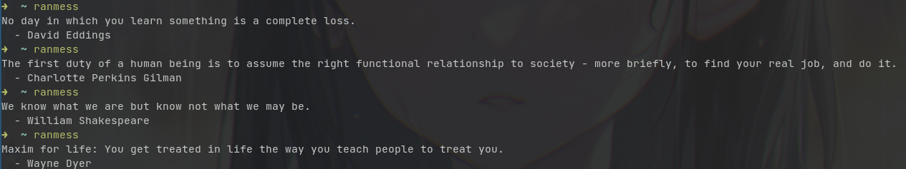

# ranmess

Get random quotes in terminal.

This project makes Fetch of the [Quotable.io API](https://api.quotable.io/random).



## Install

`npm -g i ranmess`

## Usage

```bash
ranmess
```

### License

[MIT](./LICENSE)

### Alternative

I also developed this in Python: [UltiRequiem/quoteran](https://github.com/UltiRequiem/quoteran)

(**Spoiler**: Is a lot more easy and comforting to develop in Nodejs.)
